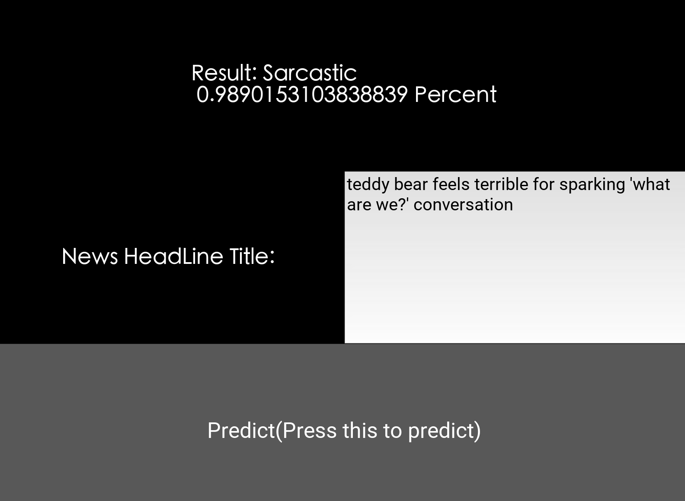

# Sarcastic-Headlines-Detector

## **Demo**

This is a research project aimed to classify news headlines as sarcastic or not sarcastic. 
We use several AI techniques to build a robust classification model that has a prediction
accuracy of 92%.

For a complete description of our intentions and datasets utliized behind
out project. Click 
[Here!](https://docs.google.com/document/d/1-SCJgot_jPTj3Lky_OkBbTiQKQfXA-VD9fr4goiC6Qo/edit)